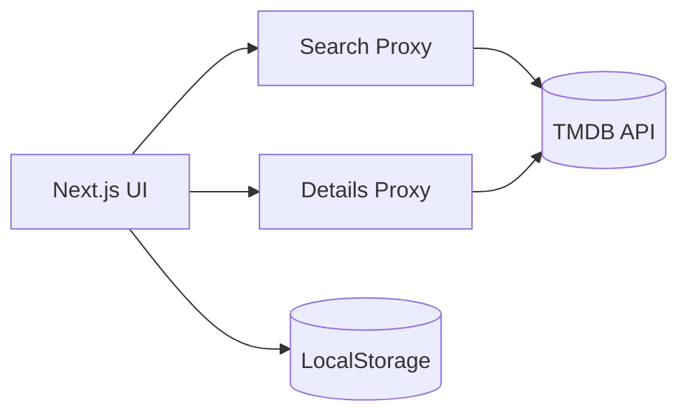

# Movie Explorer

**Hosted App:** https://movie-explorer-six-zeta.vercel.app

Movie Explorer lets users search movies, open a details view, and save favorites with a personal rating (1–5) and optional note. Movie data is fetched from TMDB through server-side Next.js proxy routes (so the API key stays hidden). Favorites are persisted in LocalStorage so they survive refresh.

---
## Core Features

- **Search** by movie title (poster, title, year/release date, short description)
- **Details** view (modal) with poster, overview, year, runtime (if available)
- **Favorites** add/remove + rating (1–5) + optional note
- **Persistence** via LocalStorage (survives refresh)
- **API Proxy** via Next.js route handlers (TMDB key not exposed)
- **Error handling** for no results, invalid inputs, and API/network issues

---

## Architecture

---
## Technical Decisions & Tradeoffs

### API proxy (TMDB key stays server-side)
- I used Next.js Route Handlers under `app/api/tmdb/*` as a thin proxy to TMDB.
- This keeps the TMDB API key on the server (`TMDB_API_KEY` in `.env.local`) and avoids exposing it in the browser.
- Tradeoff: adds one extra hop (UI → Next API → TMDB), but security + interview discussion value is worth it.

### State management (simple hook, no heavy libs)
- Favorites are managed with a custom hook `useFavorites()` and React state.
- I avoided Redux/Zustand since the app is small and the requirements focus on a working prototype.
- Tradeoff: not ideal for huge apps, but clean and easy to reason about for this scope.

### Persistence choice (LocalStorage baseline)
- Favorites persist via LocalStorage so they survive refresh and require no DB setup.
- Tradeoff: data is per-browser and not shareable across devices/users.
- Optional future: add server persistence with an API + DB (see “Improvements”).

---

## Technical Requirements Checklist

### Frontend
- ✅ Next.js App Router + React
- ✅ TypeScript used across UI and API code

### Backend
- ✅ Next.js Route Handlers proxy TMDB:
  - `GET /api/tmdb/search`
  - `GET /api/tmdb/movie/[id]`
- ⏳ Optional server-side persistence not implemented (kept scope small)

### Data
- ✅ LocalStorage used for favorites persistence (baseline requirement)
- ⏳ Optional DB not added (would be next step)

### Hosting
- ✅ Deployed on Vercel with a public URL (full app accessible)

---

## Known Limitations

- Favorites are client-only (LocalStorage), not synced across devices.
- No authentication, so favorites are not tied to a user account.
- Basic rate-limit handling; TMDB limits could be hit with heavy usage.
- Search UX is simple (no pagination/infinite scroll, no advanced filters).
- Minimal accessibility polish (keyboard focus states could be improved more).

---

## What I’d Improve With More Time

- Add server-side persistence:
  - API routes: `POST/GET/DELETE /api/favorites`
  - DB: SQLite/Postgres via Prisma
  - Optional auth (NextAuth) to tie favorites to users
- Add pagination + debounced search, reduce TMDB calls.
- Add better empty/error UI states and skeleton loading.
- Add automated tests (unit tests for hook + API routes).
- Improve accessibility: focus trap in modal, ARIA labels, keyboard navigation.

